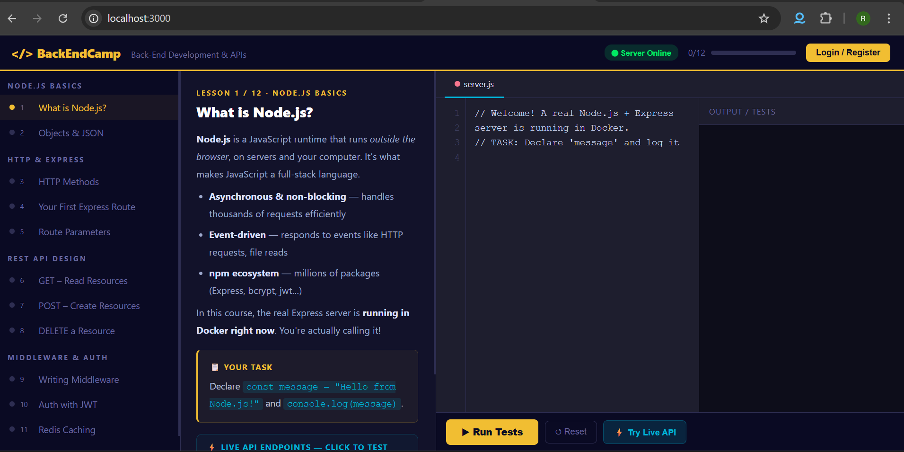

# 🚀 BackEndCamp — Interactive Back-End Development Course

> A self-hosted, freeCodeCamp-style interactive learning platform  
> built with a **real production stack** — not simulated in the browser.




---

## 🎯 What Is This?

An interactive coding course that runs entirely on your machine using Docker.  
Every lesson has a **live code editor**, **real test runner**, and **live API explorer**  
that calls an actual Express server — not a simulation.

---

## 🏗️ Architecture
```
Browser (localhost:3000)
        │
        ▼
   ┌─────────┐
   │  Nginx  │  serves frontend + proxies /api/*
   └────┬────┘
        ▼
   ┌─────────┐
   │ Express │  JWT auth · rate limiting · validation
   └────┬────┘
        │
   ┌────┴────┐
   ▼         ▼
┌──────┐  ┌───────┐
│  PG  │  │ Redis │
└──────┘  └───────┘
```

---

## 📚 12 Interactive Lessons

| # | Lesson | Concepts |
|---|--------|----------|
| 1 | What is Node.js? | Variables, console, runtime |
| 2 | Objects & JSON | JSON.stringify, data structures |
| 3 | HTTP Methods | GET, POST, PATCH, DELETE |
| 4 | Your First Express Route | app.get(), req, res |
| 5 | Route Parameters | req.params, req.query |
| 6 | GET – Read Resources | Pagination, Redis caching |
| 7 | POST – Create Resources | req.body, validation, 201 |
| 8 | DELETE a Resource | 404, 403, 204 ownership checks |
| 9 | Writing Middleware | next(), req augmentation |
| 10 | Auth with JWT | Bearer tokens, authentication |
| 11 | Redis Caching | Cache-aside pattern |
| 12 | Error Handling | ApiError class, global handler |

---

## ⚡ Quick Start
```bash
git clone https://github.com/rajeshrasamalla/backendcamp.git
cd backendcamp
docker compose up
```

Open **http://localhost:3000** — that's it.

> **Requirements:** Docker Desktop only. Nothing else to install.

---

## 🔑 Test Credentials

| Email | Password | Role |
|-------|----------|------|
| alice@example.com | password | admin |
| bob@example.com | password | user |

---

## 🛠️ Tech Stack

| Layer | Technology |
|-------|-----------|
| Runtime | Node.js 20 |
| Framework | Express.js 4 |
| Database | PostgreSQL 16 |
| Cache | Redis 7 |
| Auth | JWT + bcrypt |
| Proxy | Nginx |
| Container | Docker Compose |

---

## 📁 Project Structure
```
backendcamp/
├── docker-compose.yml
├── frontend/index.html        ← entire course UI
├── nginx/nginx.conf           ← reverse proxy
└── backend/
    ├── src/
    │   ├── server.js
    │   ├── routes/            ← auth, users, posts, progress
    │   ├── middleware/        ← JWT auth, logger, error handler
    │   └── db/                ← PostgreSQL + Redis clients
    └── db/init.sql            ← schema + seed data
```

---

*Built as a hands-on learning project to understand full-stack back-end development.*